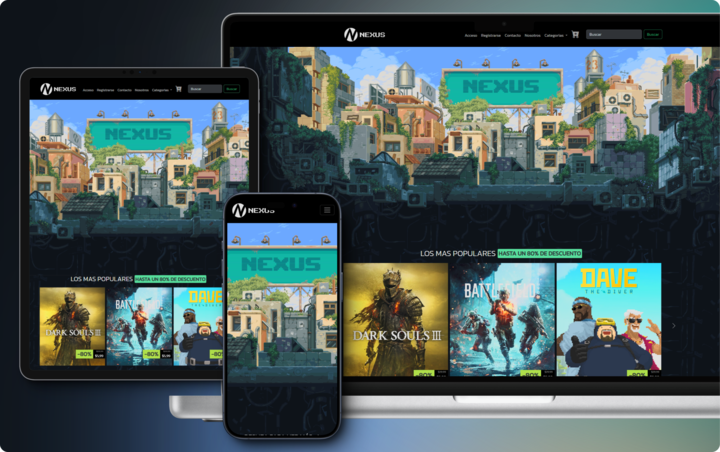

<!----Project Logo---->
 <div aling ="center">
 <a href = "https://nexus-89i.netlify.app">
 
 </a>
<h1>NEXUS</h1>

<p>
Principal referente en Argentina en el ambito de los videojuegos, Nexus se destaca <br>
Por ofrecer las mas destacadas ofertas y descuentos en un amplio catalogo.
<br>
<a href="https://nexus-89i.netlify.app" alt ="">
<strong>Explorar pagina »</strong>
</a>
<br>
<br>
<a href="https://nexus-89i.netlify.app">Reportar un problema</a>
 ·
<a href="https://nexus-89i.netlify.app">Solicitar una mejora</a>
<a href="https://nexus-89i.netlify.app">Soporte</a>
</p>
 </div>

## 📋 Tabla de contenido
<!----Control mas espacio para seleccionar categoria en el parentesis---->
- [💻 Tabla de contenido](#📋-tabla-de-contenido)
- [💻 Sobre NEXUS](#💻-sobre-nexus)
- [⚒️Tecnologias](#⚒️-tecnologias-implementadas)
- [✅ Requisitos](#✅-requisitos)
- [💿 Instalacion](#💿-instalacion-y-uso)
- [🤝 Contribuir](#🤝-como-contribuir)
- [👨‍💻 Autores](#👨‍💻👩‍💻-autores)
- [📞 Contacto](#📞-contactanos)
- [📄 Licencia](#📄-licencia)


## 💻 Sobre NEXUS

<!----El corchete va el alt, en los parentesis el link de la pagina--->



¡Bienvenido a NEXUS, tu destino definitivo para la aventura digital en el mundo de los videojuegos! Situada en el vibrante corazón de Argentina, NEXUS es mucho más que una plataforma de compra de videojuegos; es tu puerta de entrada a un universo repleto de emociones y desafíos virtuales.

Explora nuestro vasto catálogo de títulos de última generación, cuidadosamente seleccionados para satisfacer los gustos de jugadores de todas las edades y géneros. Desde épicos juegos de rol hasta trepidantes experiencias multijugador, en NEXUS encontrarás un abanico de opciones que te transportarán a mundos asombrosos y te sumergirán en historias inolvidables.

Nuestra plataforma no solo se trata de comprar juegos, sino de construir una comunidad apasionada de jugadores. Únete a nosotros en foros dinámicos, donde podrás intercambiar estrategias, descubrir secretos y conectarte con otros fanáticos del gaming. Además, mantente al tanto de nuestras ofertas exclusivas y eventos especiales que harán que cada visita a NEXUS sea una experiencia única.

Sumérgete en el universo de NEXUS, donde la pasión por los videojuegos se encuentra con la comodidad de la tecnología moderna. ¡Prepárate para jugar, explorar y vivir la aventura en NEXUS, la plataforma de videojuegos líder en Argentina!

## ⚒️ Tecnologias implementadas

|Tecnologia |Version|

|---|---|
[ ! [HTML5-badge]](HTML-url) |**5**
[ ! [CSS3-badge]] (CSS3-url) |**3**
[ ! [Boostrap-badge]] (Bootstrap-url) |**5.3**
[ ! [Github-badge]] (Bootstrap-url) |-
[ ! [Trello-badge]] (Trello-url) |-

## ✅ Requisitos

- Windows 10 o superior
- Github
- Visual Code
- Extension "Live Server" para Visual Code

> [ !IMPORTANT]
> Para que funcione el proyecto en su PC debe cumplir con el **todos** los requisitos

## 💿 Instalacion y uso

- Clonar repositorio:

```bash
git clone https://github.com/nexus/nexus-shop.git
```

- Asegurarse que se encuentra en la rama `main`
- Ejecutar el archivo `index.html` con la extension Live Server
- Una vez iniciada la aplicacion, la misma se podra previsualizar en el siguiente link `http://127.0.0.1:5500/index.html`

## 🤝 Como contribuir?

Para contribuir, por favor seguir los siguientes pasos:

1. Hacer un Fork del repositorio y clonarlo
2. Crear desde la rama `dev` una nueva rama para comenzar `git checkout -b nueva-rama`
3. Realizar los cambios y subirlos a su fork `git push origin nueva-rama`
4. Solicitar un Pull Request a la rama `dev` al repositorio original

## 👨‍💻👩‍💻 Autores

_Diaz Cristian_

- Github:http://github.com/CristianDecidueye
- Linkedin:http://linkedin/CristianProgrammer98

**Emilse Arias**

- Github:http://github.com/EmilseArias
- Linkedin:http://linkedin/EmilseArias

## 📞 Contactanos

| Medio    | Link                              |
| -------- | --------------------------------- |
| Email    | nexus@gmail.com                   |
| Twitter  | https://twitter.com/nexus         |
| Linkedin | https://www.linkedin.com/in/nexus |

## 📄 Licencia

Codigo y documentacion copyright 2023-2024 de los autores de NEXUS. Distribuido bajo la licencia MIT. Consulte el archivo LICENSE.md para obtener mas informacion.


<!---Markdown links & images--->

[HTML-5-badge]: https://img.shields.io/badge/CSS3-1572B6?style=for-the-badge&logo=css3&logoColor=white
[Boostrap-url]: https://getbootstrap.com/#7952B3

https://img.shields.io/badge/GitHub-100000?style=for-the-badge&logo=github&logoColor=white
